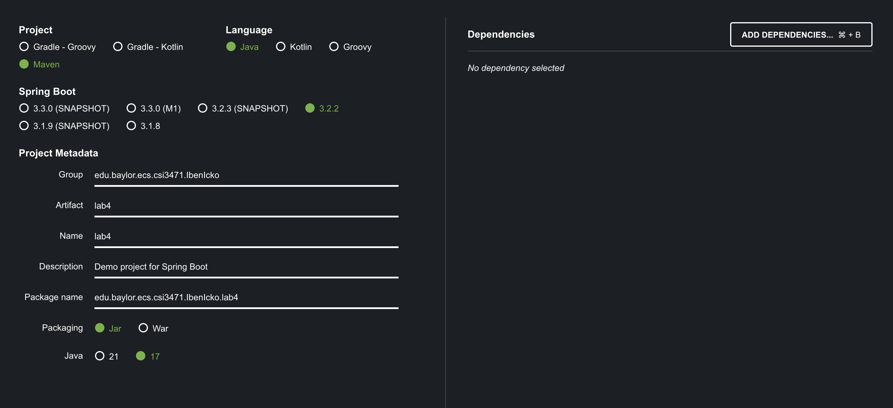
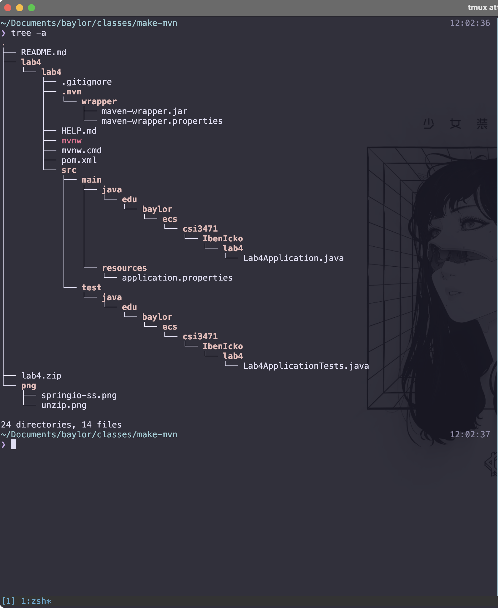

# How to Generate a Maven Project

## Contents

1. [Installing Maven](#installing-maven)
2. [Creating Your Repository](#creating-your-repository)
    1. [Using Command Line](#using-command-line)
    2. [Using Spring Framework](#using-spring-framework)
3. [Editing the Pom](#editing-the-pom)
    1. [Removing Springwork Dependencies](#removing-springwork-dependencies)
    2. [Adding Dependencies and Plugins](#adding-dependencies-and-plugins)
    3. [Designate a Main Class](#designate-a-main-class)
4. [Final pom](#final-pom)
5. [Compiling Your Project](#compiling-your-project)


## Installing Maven

This guide assumes you already have Maven installed and you are able to 
run `mvn` from the command line.  

If you do not have it installed, follow one of the following guides depending 
on your operating system:  

1. [macOS](https://www.digitalocean.com/community/tutorials/install-maven-mac-os)
2. [Windows](https://phoenixnap.com/kb/install-maven-windows)


## Creating Your Repository

You can create a repository one of two ways. Through the command line or 
using the Spring Framework.

1. [Using Command Line](#command-line)
2. [Using Spring Framework](#spring-framework)

### Using Command Line

Open the terminal and move to the directory where you would like to store your 
project. Run the command below, changing the `-DgroupId` and `-DartifactId`.

* `-DgroupId`: name of the organization in charge of the project
    * i.e. `edu.baylor.ecs.csi3471.YourName`
* `-DartifactId`: name of the built project

```zsh
mvn archetype:generate -DgroupId=com.mycompany.app -DartifactId=my-app -DarchetypeArtifactId=maven-archetype-quickstart -DarchetypeVersion=1.4 -DinteractiveMode=false
```

***At this point, skip ahead to***: [Adding Dependencies and Plugins](#adding-dependencies-and-plugins)

### Using Spring Framework

You can use the following site to get a repository automatically setup for you. 
<https://start.spring.io/>. 

Make sure to specify your group and artifact. 'Group' is the organization that 
is in charge of creating this project (i.e. edu.baylor.ecs.csi3471.name). 
'Artifact' is the name of the artifact that is created after packaging/compiling. 
Don't worry about adding any dependencies. We will do that later.  

  

Once finished, click 'Generate' and save the zip file to your computer. Navigate 
to where the zip file is stored and extract the contents.  

At this point, you should have a directory that has the following file structure:  

  

## Editing the pom

If you created your repository from the command line, skip the next section 
(Removing Springwork Dependencies) and move the the following section (Adding 
Dependencies and Plugins).

### Removing Springwork Dependencies

Navigate into the extracted repository. We will now edit the pom file. `pom.xml` 
contains the configuration for our project. The `pom.xml` generated by 
<https://start.spring.io/> should look similar to the one below.  

```xml
<?xml version="1.0" encoding="UTF-8"?>
<project xmlns="http://maven.apache.org/POM/4.0.0" xmlns:xsi="http://www.w3.org/2001/XMLSchema-instance"
	xsi:schemaLocation="http://maven.apache.org/POM/4.0.0 https://maven.apache.org/xsd/maven-4.0.0.xsd">
	<modelVersion>4.0.0</modelVersion>
	<parent>
		<groupId>org.springframework.boot</groupId>
		<artifactId>spring-boot-starter-parent</artifactId>
		<version>3.2.2</version>
		<relativePath/> <!-- lookup parent from repository -->
	</parent>
	<groupId>edu.baylor.ecs.csi3471.IbenIcko</groupId>
	<artifactId>lab4</artifactId>
	<version>0.0.1-SNAPSHOT</version>
	<name>lab4</name>
	<description>Demo project for Spring Boot</description>
	<properties>
		<java.version>17</java.version>
	</properties>
	<dependencies>
		<dependency>
			<groupId>org.springframework.boot</groupId>
			<artifactId>spring-boot-starter</artifactId>
		</dependency>

		<dependency>
			<groupId>org.springframework.boot</groupId>
			<artifactId>spring-boot-starter-test</artifactId>
			<scope>test</scope>
		</dependency>
	</dependencies>

	<build>
		<plugins>
			<plugin>
				<groupId>org.springframework.boot</groupId>
				<artifactId>spring-boot-maven-plugin</artifactId>
			</plugin>
		</plugins>
	</build>

</project>
```

We do not actually need the Spring framework, so go ahead and delete the `<parent>`,
`<dependency>`, and `<plugin>` fields for the Spring framework. 
Your pom.xml should now look like this:  

```xml
<?xml version="1.0" encoding="UTF-8"?>
<project xmlns="http://maven.apache.org/POM/4.0.0" xmlns:xsi="http://www.w3.org/2001/XMLSchema-instance"
	xsi:schemaLocation="http://maven.apache.org/POM/4.0.0 https://maven.apache.org/xsd/maven-4.0.0.xsd">
	<modelVersion>4.0.0</modelVersion>

	<groupId>edu.baylor.ecs.csi3471.IbenIcko</groupId>
	<artifactId>lab4</artifactId>
	<version>0.0.1-SNAPSHOT</version>
<properties> <java.version>17</java.version>
        <project.build.sourceEncoding>UTF-8</project.build.sourceEncoding>
	</properties>

	<dependencies>
        <dependency>
        </dependency>
	</dependencies>

	<build>
	</build>

</project>
```

### Adding Dependencies and Plugins

For our project, we will be utilizing the Maven Shade plugin to package our 
artifact into an uber-jar (i.e. a jar that contains all dependencies required 
to run our project). We will also be utilizing junit and surefire to do our 
unit testing.

See more: 
* <https://maven.apache.org/plugins/maven-shade-plugin/>  
* <https://www.digitalocean.com/community/tutorials/junit-setup-maven>  

With those added, our new `pom.xml` should like like the following:  

```xml
<dependencies>
    <!-- junit5 for unit tests -->
    <!-- https://www.digitalocean.com/community/tutorials/junit-setup-maven -->
    <dependency>
        <groupId>org.junit.jupiter</groupId>
        <artifactId>junit-jupiter-engine</artifactId>
        <version>5.2.0</version>
        <scope>test</scope>
    </dependency>
    <dependency>
        <groupId>org.junit.platform</groupId>
        <artifactId>junit-platform-runner</artifactId>
        <version>1.2.0</version>
        <scope>test</scope>
    </dependency>
</dependencies>
```
```xml
<build>
    <plugins>
        <!-- surefire plugin to allow tests to be executed during the maven build -->
        <!-- https://www.digitalocean.com/community/tutorials/junit-setup-maven -->
        <plugin>
            <groupId>org.apache.maven.plugins</groupId>
            <artifactId>maven-surefire-plugin</artifactId>
            <version>2.22.0</version>
            <dependencies>
                <dependency>
                    <groupId>org.apache.maven.surefire</groupId>
                    <artifactId>surefire-junit4</artifactId>
                    <version>2.22.0</version>
                </dependency>
            </dependencies>
            <configuration>
                <includes>
                    <include>**/*.java</include>
                </includes>
            </configuration>
        </plugin>

        <!-- maven-shade-plugin can package the artifact in an uber-jar -->
        <!-- the uber-jar consists of all dependencies required to run the project -->
        <!-- https://maven.apache.org/plugins/maven-shade-plugin/ -->
        <!-- goals for the Shade Plugin are bound to the `package` phase -->
        <plugin>
            <groupId>org.apache.maven.plugins</groupId>
            <artifactId>maven-shade-plugin</artifactId>
            <version>3.5.1</version>
            <executions>
                <execution>
                    <phase>package</phase>
                    <goals>
                        <goal>shade</goal>
                    </goals>
                  </execution>
            </executions>
        </plugin>
    </plugins>
</build>
```

### Designate a Main Class

If we have multiple `.java` files, we need to specify a main class in our pom 
file. This is equivalent to having a `Manifest.txt` file. Add the following in 
the `<configuration>` field under plugins.  

See more: 

* <https://maven.apache.org/plugins/maven-shade-plugin/examples/executable-jar.html>

```xml
<configuration>
    <transformers>
        <transformer implementation="org.apache.maven.plugins.shade.resource.ManifestResourceTransformer">
            <mainClass>org.sonatype.haven.HavenCli</mainClass>
        </transformer>
    </transformers>
</configuration>
```


## Final Pom

With all the changes, our pom should now look like this: 

```xml
<?xml version="1.0" encoding="UTF-8"?>
<project xmlns="http://maven.apache.org/POM/4.0.0" xmlns:xsi="http://www.w3.org/2001/XMLSchema-instance"
    xsi:schemaLocation="http://maven.apache.org/POM/4.0.0 https://maven.apache.org/xsd/maven-4.0.0.xsd">
    <modelVersion>4.0.0</modelVersion>

    <groupId>edu.baylor.ecs.csi3471.IbenIcko</groupId>
    <artifactId>asgmt4</artifactId>
    <version>0.0.1-SNAPSHOT</version>
    <!--description>OPTIONAL</description-->

    <properties>
        <java.version>17</java.version>
        <project.build.sourceEncoding>UTF-8</project.build.sourceEncoding>
    </properties>

    <dependencies>
        <!-- junit5 for unit tests -->
        <!-- https://www.digitalocean.com/community/tutorials/junit-setup-maven -->
        <dependency>
            <groupId>org.junit.jupiter</groupId>
            <artifactId>junit-jupiter-engine</artifactId>
            <version>5.2.0</version>
            <scope>test</scope>
        </dependency>
        <dependency>
            <groupId>org.junit.platform</groupId>
            <artifactId>junit-platform-runner</artifactId>
            <version>1.2.0</version>
            <scope>test</scope>
        </dependency>
    </dependencies>

    <build>
        <plugins>
            <!-- surefire plugin to allow tests to be executed during the maven build -->
            <!-- https://www.digitalocean.com/community/tutorials/junit-setup-maven -->
            <plugin>
                <groupId>org.apache.maven.plugins</groupId>
                <artifactId>maven-surefire-plugin</artifactId>
                <version>2.22.0</version>
                <dependencies>
                    <dependency>
                        <groupId>org.apache.maven.surefire</groupId>
                        <artifactId>surefire-junit4</artifactId>
                        <version>2.22.0</version>
                    </dependency>
                </dependencies>
                <configuration>
                    <includes>
                        <include>**/*.java</include>
                    </includes>
                </configuration>
            </plugin>

            <!-- maven-shade-plugin can package the artifact in an uber-jar -->
            <!-- the uber-jar consists of all dependencies required to run the project -->
            <!-- https://maven.apache.org/plugins/maven-shade-plugin/ -->
            <!-- goals for the Shade Plugin are bound to the `package` phase -->
            <plugin>
                <groupId>org.apache.maven.plugins</groupId>
                <artifactId>maven-shade-plugin</artifactId>
                <version>3.5.1</version>
                <executions>
                    <execution>
                        <phase>package</phase>
                        <goals>
                            <goal>shade</goal>
                        </goals>
                        <configuration>
                            <transformers>
                                <transformer implementation="org.apache.maven.plugins.shade.resource.ManifestResourceTransformer">
                                    <mainClass>edu.baylor.ecs.csi3471.IbenIcko.App</mainClass>
                                </transformer>
                            </transformers>
                        </configuration>
                    </execution>
                </executions>
            </plugin>
        </plugins>
    </build>

</project>
```

### Compiling Your Project

At this point, we can now package our project into a jar using `mvn package`. 
This will store our built artifact in the `target/` directory. The target can 
be run using `java -jar`. For example:  

```zsh
mvn package
java -jar target/lab4-0.0.1-SNAPSHOT.jar
```
